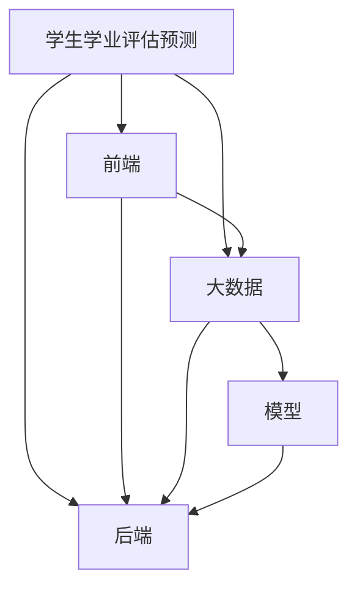
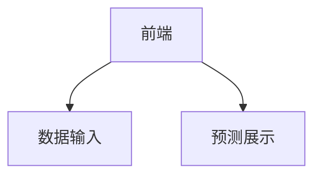
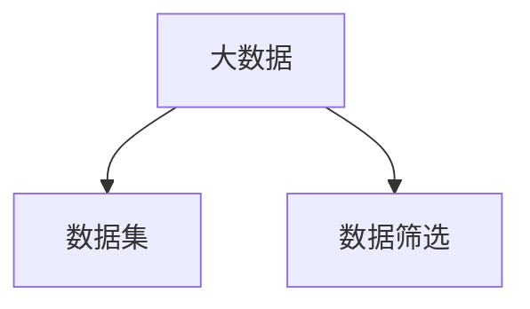
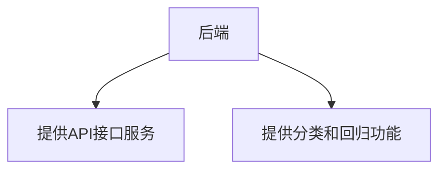

# 需求分析文档

## 1 范围

### 1.1 标识

本系统计划适用于Windows操作系统下安装及使用。 

文件状态： 报告编号 学生学业评估预测需求分析文档

- [    ]  草稿 TODO-001
- [ √ ]  正式发布 当前版本 V1.0
- [    ]  正在修改 编写人 许文瑞 许晨阳 杨帅 郑朔宁 翁韬 蔡维洋

 编写日期 2020-9-9 审批人 TODO小组 审批日期 2020-9-9

### 1.2 系统概述

为了预测学生在不同目标下的表现，已经进行了广泛的努力，例如：发现有风险的学生，保证学生的保留率，课程和资源分配以及许多其他目的。这项研究旨在预测学生的表现，以吸引不同的学生参与研究和创新项目，以提高大学的声誉并在国内和国际上排名。但是，在教育或学习分析领域从未探索过分析初创到中型机构或学校的学生记录，例如迪拜的英国大学，这些学生记录的规模很小。然而，在其他领域进行了调查，例如：卫生科学和化学家（Ingrassia＆Morlini，[2005](https://educationaltechnologyjournal.springeropen.com/articles/10.1186/s41239-019-0160-3#ref-CR7) ; Pasini，[2015](https://educationaltechnologyjournal.springeropen.com/articles/10.1186/s41239-019-0160-3#ref-CR13)）。因此，本项目旨在探讨小学生数据集规模在教育领域的利用可能性。

### 1.3 文档概述

通过本次项目开发，深入了解机器学习和大数据的开发内容和运行过程，将所学的技术运行到项目中去。

### 1.4 基线

1.学生学业评估预测需求分析文档 V1.0

## 2 引用文件

无

## 3 需求

### 3.1 所需的状态和方式

本系统所需的状态和方式没有特殊需求。

### 3.2 需求概述

#### 3.2.1 目标

通过对样本多维度的特征分析，训练出回归模型，从而预测出期末成绩。

#### 3.2.2 运行环境

##### 3.2.2.1 硬件环境

CPU：2.2GHz以上

内存：2G以上

硬盘：可用空间3G以上

显示：1280x1024分辨率及以上

##### 3.2.2.2 软件环境

Window7 以上

#### 3.2.3 用户的特点

所有代码编辑人员

#### 3.2.4 关键点

大数据方面：

* 大数据的选取目前只找到了600+，需要更多的数据。
* 数据预处理难度比较大。

AI方面：

* 选取合适的基模型。
* 选取合适的集成算法。

web方面：

* 前后端跨域问题和技术栈的实现。

#### 3.2.5 约束条件

- 数据集最好达到万级
- 最终的准确度达到80以上

### 3.3 需求规格

#### 3.3.1 软件系统总体功能/对象结构

#### 3.3.2 软件子系统功能/对象结构

#### 3.3.3 描述约定

无

### 3.4 CSCI能力需求

1. 输入项

   | 数据项             | 类型 | 数据精度 |
   | ------------------ | ---- | -------- |
   | 性别               | 字符 | 40       |
   | 年龄               | 整型 | 40       |
   | 地址               | 字符 | 40       |
   | 家庭规模           | 字符 | 40       |
   | 父母的同状况       | 字符 | 40       |
   | 母亲的教育         | 整型 | 40       |
   | 父亲的教育         | 整型 | 40       |
   | 母亲的工作         | 字符 | 40       |
   | 父亲的工作         | 字符 | 40       |
   | 选择这所学校的理由 | 字符 | 40       |
   | 学生的监护人       | 字符 | 40       |
   | 出行时间           | 整型 | 40       |
   | 每周学习时间       | 整型 | 40       |
   | 失败次数           | 整型 | 40       |
   | 额外的教育支持     | 字符 | 40       |
   | 家族的教育支持     | 字符 | 40       |
   | 付费课程           | 字符 | 40       |
   | 课外活动           | 字符 | 40       |
   | 托儿所             | 字符 | 40       |
   | 想要接受更高的教育 | 字符 | 40       |
   | 是否再家上网       | 字符 | 40       |
   | 浪漫关系           | 字符 | 40       |
   | 家庭成员质量       | 整型 | 40       |
   | 空闲时间           | 整型 | 40       |
   | 外出次数           | 整型 | 40       |
   | 工作日酒精消耗     | 整型 | 40       |
   | 周末酒精消耗       | 整型 | 40       |
   | 健康状况           | 整数 | 40       |
   | 缺勤次数           | 整型 | 40       |
   | 第一阶段成绩       | 整型 | 40       |
   | 第二阶段成绩       | 整型 | 40       |

2. 处理过程

   将数据经过模型预测得到预测值。

3. 输出项

   | 数据项   | 类型 | 数据精度 |
   | -------- | ---- | -------- |
   | 最终成绩 | 整型 | 40       |

### 3.5 CSCI接口需求

**需要检测的接口**

- target 用于返回数据集中最终成绩中每个分数的数据集数量
- column 输入一个维度，返回该维度中每个取值的数据集数量
- modelType 输入一个版本，返回该版本的性能
- importance 返回本项目每个数据的特征权重
- appearance 返回随机森林，CatBoost等模型性能
- form 返回一组数据每个维度的数据类型
- dataset 输入一个文档，返回多组数据每个维度的数据类型

### 3.6 CSCI内部数据需求

内部数据需求在详细设计时确定

### 3.7 适应性需求

满足个人用户的使用需求，系统资源不应过分占用。

### 3.8 保密性需求

无严格保密性信息。

### 3.9 保密性和私密性需求

系统中正在编辑的文件不应被其他进程访问。

### 3.10 CSCI环境需求

本系统运行环境需求：

- 显示器分辨率：最低1024*768
- 网络环境：局域网
- 操作系统：Windows 7/8/10 或以上，OS X 10.11以上，Linux (发行版Ubuntu 16.04 64-bit以上版本 或等同于Debian 8.0及以上版本)

### 3.11 计算机资源需求

#### 3.11.1 计算机硬件需求

| 计算机硬件 | 配置                |
| ---------- | ------------------- |
| CPU        | 2.2GHz或更高        |
| 内存       | 最少2G内存，最佳8G  |
| 硬盘       | 最少512M的剩余空间  |
| 显示       | 最少720P，最佳1080P |

#### 3.11.2 计算机软件需求

| 计算机软件 | 配置                                  |
| ---------- | ------------------------------------- |
| 操作系统   | 最低：Windows 10, MacOS，最优：全平台 |

#### 3.11.3 计算机通信需求

基于软件使用特性，通信系统非必要。

### 3.12 软件质量因素

- 单次读写时间
- 单个文档预测时间
- 预测准确率

### 3.13 数据

#### 3.13.1 静态数据

* target 用于返回数据集中最终成绩中每个分数的数据集数量
* column 输入一个维度，返回该维度中每个取值的数据集数量
* modelType 输入一个版本，返回该版本的性能
* importance 返回本项目每个数据的特征权重
* appearance 返回随机森林，CatBoost等模型性能

#### 3.13.2 动态数据

- form 返回一组数据每个维度的数据类型
- dataset 输入一个文档，返回多组数据每个维度的数据类型

### 3.14 操作

### 3.15 故障处理

正常使用时不应出错，若运行时遇到不可恢复的系统错误，必须保证数据库完好无损。

### 3.16 算法说明

略。

### 3.17 有关人员需求

5名开发人员，了解软件开发过程，熟悉开发语言。

### 3.18 有关培训需求

暂无

### 3.19 有关后勤需求

暂无

### 3.20 其他需求

暂无

### 3.21 包装需求

暂无

### 3.22 需求的优先次序和关键程度

## 4 合格性规定

合格性方法，如：专用工具、技术、过程、设施、验收限制。

## 5 需求的可追踪性

本系统的设计、开发、测试、分析、评审、验收等均符合国际的合理性要求。

## 6 尚未解决的问题

暂无。

## 7 注解

### 7.1 定义

学生学业评估预测：本项目名称

### 7.2 参考资料

参考文档格式：[GB T-8567-2006 软件工程相关文档综合实例集](https://wenku.baidu.com/view/a1f1269903d276a20029bd64783e0912a2167c8b.html)
